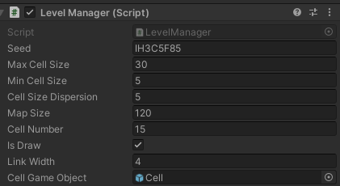
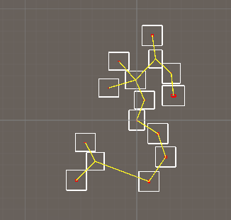

# Unity-Person-DEMO

#### 介绍
一个Roguelike地牢游戏功能暂不完整的DEMO，实现了对象池，Manager类，随机种子地图，带避障的简易AI，利用ShaderGraph制作的基简易风格化Shader和基于深度信息的描边Shader.

#### 预览
随机种子地图，使用BowyerWatson生成不规则三角网，再利用最小生成树算法，实现地图中各地图块的链接。

简易敌人AI，利用Physics检测线避障，最近在研究如果使用DOTS系统优化大量敌人AI的性能。

#### 安装教程
1.  直接导入工程

#### 使用说明
打开工程播放即可